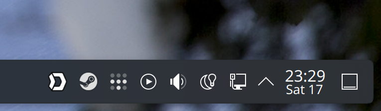

# Trayscale

A simple Tailscale systray utility for KDE Plasma:



## Requirements

Tailscale must be started with the current user:

```bash
sudo tailscale set --operator=$USER
```

## Manual install

This requires the dev setup, see section below.

```bash
make flatpak-bundle
flatpak install trayscale.flatpak
```

## Dev Setup

```
sudo dnf install python3-pyqt6 kf6-kirigami-devel flatpak-builder qqc2-desktop-style appstream-compose
python3 -m venv --system-site-packages .venv/
source .venv/bin/activate
pip install -r requirements.txt
make flatpak-build
```
